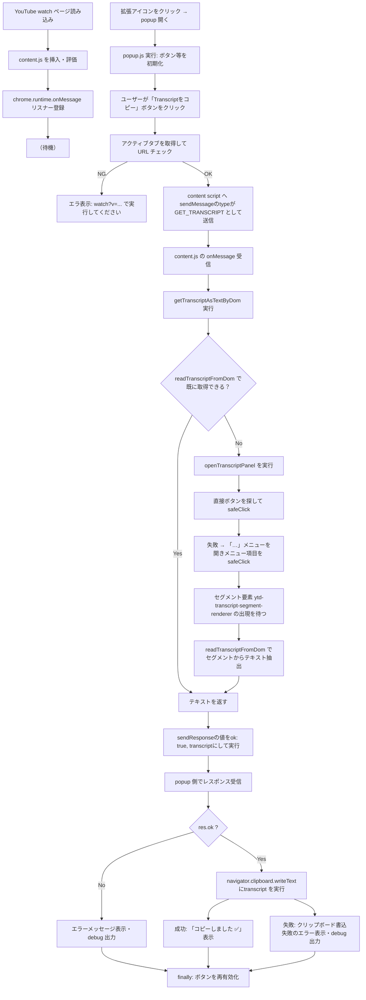

# copy-youtube-transcript-extension

YouTube動画の文字起こし（Transcript）をクリップボードにコピーするChrome拡張機能です。

## インストール方法

### 開発版のインストール

1. このリポジトリをクローンまたはダウンロード
   ```bash
   git clone https://github.com/riazumaken/copy-youtube-transcript.git
   cd copy-youtube-transcript
   ```

2. Chromeで `chrome://extensions` を開く

3. 右上の「デベロッパーモード」を有効にする

4. 「パッケージ化されていない拡張機能を読み込む」をクリック

5. このディレクトリを選択

## 使い方

1. YouTube動画ページ（字幕が利用可能な動画）を開く

2. 拡張機能アイコンをクリック

3. 「Transcriptをコピー」ボタンをクリック

4. クリップボードにTranscriptがコピーされます

## 注意事項

- 字幕が提供されていない動画では動作しません
- YouTube側のUI変更により動作しなくなる可能性があります

## 全体的な流れ



- [全体的な流れ FlowChart - Mermaid Live Editor](https://mermaid.live/edit#pako:eNp1VWtP20gU_SsjfwYrCaFRLO1WPMqjQKAhtNs1aGWSIWRJ7Mh2SikgYbuwPEJZoQLqQhXC8uwu7KPsCko2_BemdsIn_sLOXAeSIjWK7JnMvec-zpmbSS6qxDAncCNJZTw6Kqk6irQOygg1ic-VTCQzjNG4pEdHEbF-IVaBmGflD8fEuCwXC_Q5hOrrv0XNYlSRdSzr_I8aIuaqk720Z_eIdVE-WvtczA8xuGawbBGjo6qSwryakfUEfStyD9Y0KY4p_gdinhNrkUYpvbu4zv4Nfi3g1yreFObt4qxzlLspLNADdvRIdJbyduEfYu4Qc5eYH4n1kUYn5h8My7LoAl3NraK0ks6k0fX6EjFW3ITbRPiNpWuf5Mr5rEDDbxHzkiKUjhcoiD3_3tnK2dl1SKINvNpFYu1DD_5lTyNLZrIRVZK1qJpI6xCZpvCWnc0s3-Hdywjw2gGvQ4TM6dkcMX8l1jo4rLPoK-t2cYMY9LuPBsLdNDuDmAc1CB0MYSrUPoU6fBTmkFhH5fxhafeT4NL18MU3PM8jYhy4BbpYtAHE2CbGGjFe18D0dk2hzlsOkVsOdT1DGpZjFX6IcaJPpOkri9ofRX6IhJtC_S3hzr4INTx00a9njM-X-Qo5nVDi4y-UYZygKt_2yoZrjdBjsO0S41iv9rNJi-CXevNEq5KqkAS2XWDbPaliKVY1bqOiYoa0Xmdjhxi_3XbwgBjLxFy6KeSmmXc31Psca1OoR4S-H4Po5mnTy5dvifFuqGoWUqZQSFTSWK4G6pNknGQar0kpBCmFvGJp89R5s1fLvPNmp8KiJo3glmQiOua6eF0fn2jv_uWsbYBOqZyuZvZBO3liLRFrD8S2Csr94sfr7dnS5gk9ug_rA9heqogLYv4JLlSS8-V9o3S6jSb0WL1-V0q9huMpSk29SlnGKlYZQfZPn0orRVZfcZYYu4DaC6B94ldbfi8aMZaIuVDbXWfxPwoMYH0A1uOKpAc2T0SmszDW0oqsMaHZM_Q2rypjAtLVDK5D1Zwps24_a9r_BEDC7pVGtnHKMrJ-h8jvgYbzGq2Fwbqf6kfjlTH0EGTRf8d3pHKZWOdZPRarzR17cL3oUIvh4Uwc0Xrsxc2hqjeIakCUpReJuKQrKh9NJtLDiqTG-HE1oWOmZpp-tZZ7KhqAxJ6KzvzP9mJOYGqozhNWcxGeOXS1NUs14qZT4_msIiXqeTdurA0mRlbKgrN5Rke2a0JbfFfl18piwBEA_k4cSchSMjlRMyRZ6nPLztaCvXh-OySfutZs-cxdcnVcXE3EOAFo5FJYTUlsy00yo0FOH8UpPMgJdBmT1LFBblCepj5pSf5eUVK3bqqSiY9ywoiU1Oguk45JOm5NSHFVqpqAglsU-qfCCY2AwAmT3Eu6Cfr4Bvrx-oNBT2Mw8KCOm-AEr8_LBxr9_uADX8Drb_A1BqbruFcQ08MHGryeRo8n4Pd6PP6gv2H6f80jYxg)
