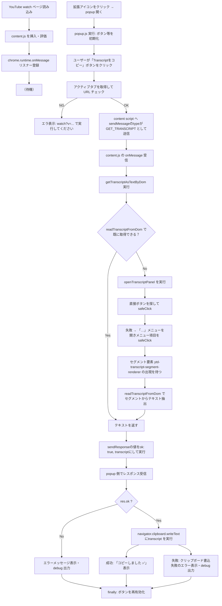

# copy-youtube-transcript-extension

YouTube動画の文字起こし（Transcript）をクリップボードにコピーするChrome拡張機能です。

## インストール方法

### 開発版のインストール

1. このリポジトリをクローンまたはダウンロード
   ```bash
   git clone https://github.com/riazumaken/copy-youtube-transcript.git
   cd copy-youtube-transcript
   ```

2. Chromeで `chrome://extensions` を開く

3. 右上の「デベロッパーモード」を有効にする

4. 「パッケージ化されていない拡張機能を読み込む」をクリック

5. このディレクトリを選択

## 使い方

1. YouTube動画ページ（字幕が利用可能な動画）を開く

2. 拡張機能アイコンをクリック

3. 「Transcriptをコピー」ボタンをクリック

4. クリップボードにTranscriptがコピーされます

## 注意事項

- 字幕が提供されていない動画では動作しません
- YouTube側のUI変更により動作しなくなる可能性があります

## 全体的な流れ


